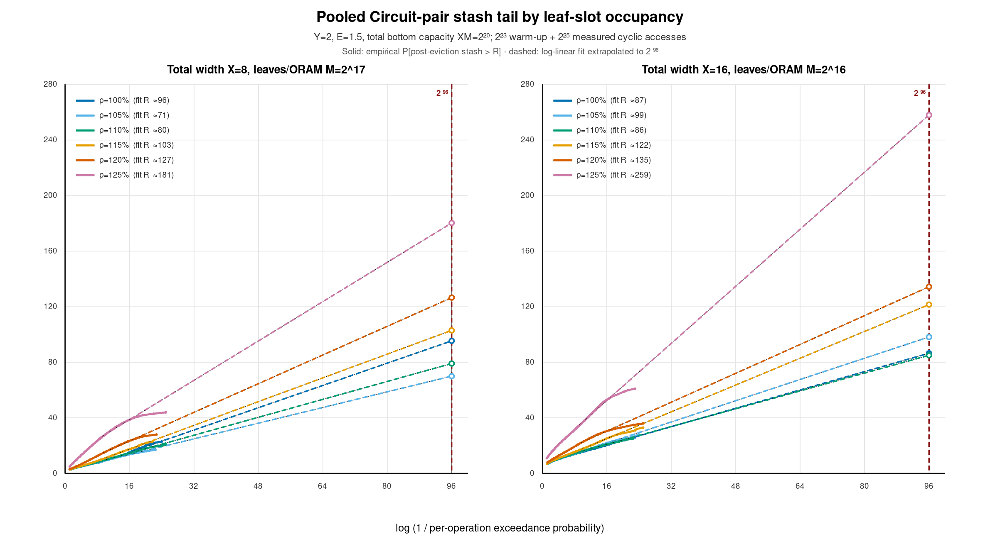

# Pooled Y=2, E=1.5 empirical stash tails

## Result

At logical scale `N >= 2^20`, reducing load helps substantially, but it does
not make a stash near 50 blocks defensible for a per-operation overflow target
of `2^-96`. The useful next lever is a higher deterministic eviction rate.

The point estimate is a linear tail extrapolation. The engineering setting
takes a monotone envelope over load of tail-window fits from the large run and
longer small-tree control, includes the 95th percentile across large-run
epochs, adds eight blocks, and rounds upward to a multiple of eight.

| Total width X | Load rho | Observed insertion max | Point estimate at 2^-96 | Engineering setting |
|---:|---:|---:|---:|---:|
| 8 | 100% | 25 | 96 | 128 |
| 8 | 105% | 19 | 71 | 128 |
| 8 | 110% | 23 | 80 | 128 |
| 8 | 115% | 25 | 104 | 136 |
| 8 | 120% | 30 | 128 | 160 |
| 8 | 125% | 46 | 181 | 224 |
| 16 | 100% | 28 | 88 | 112 |
| 16 | 105% | 30 | 99 | 128 |
| 16 | 110% | 27 | 86 | 128 |
| 16 | 115% | 35 | 123 | 152 |
| 16 | 120% | 38 | 135 | 176 |
| 16 | 125% | 63 | 259 | 312 |

Small nonmonotonicities at 100--110% are fit noise, not evidence that adding
blocks improves the tail. The engineering column is therefore monotone.

For a stash near 50, lowering rho within the measured 100--125% range is
insufficient. Test `E=1.75` and `E=2` at rho=100% and 110%. Raising E from
1.5 to 2 raises path-slot work from five to six slots per tree level per
operation, a 20% increase, but acts directly on the tail. Loads of 120--125%
are unattractive for a small cryptographic stash.

## Figure 3 analogue

The horizontal axis is `log2(1 / Pr[stash > R])`; the vertical axis is stash
threshold `R` in blocks. Solid curves are measured post-eviction tails.
Dashed curves extrapolate linear fits to 96 bits. Operational sizing uses the
insertion tail, which is one block above the plotted post-eviction tail.

## Scale, workload, and schedule

`X` is total bottom-level slot width. A pooled constituent has `Y=2`, so
there are `X/2` constituent Circuit-style ORAMs. Total bottom capacity was
fixed at `XM=2^20`: `M=2^17` for X=8 and `M=2^16` for X=16. The key count
is `K=rho XM`, from `2^20` through `1.25*2^20`. The workload cycles
through all keys. Initialization and replacements use OS `getrandom`.

Each primary configuration used `2^23` warm-up and `2^25` measured
operations in eight epochs. The control used `M=2^10`, `2^25` warm-up, and
`2^27` measured operations.

The scheduler uses exact rational credit. For X=16 there are eight pooled
constituents, so E=1.5 gives synchronized round rate `(3/2)/8=3/16`. A round
is emitted when `floor(3(t+1)/16)>floor(3t/16)`: after operations 6, 11, 16,
22, and so on, with steady gaps 5, 5, 6. It evicts the same bit-reversed path
from every constituent. A normal access evicts only its accessed constituent.

## Interpretation and limitations

The approximately straight measured curves support an exponential tail in
the observable range, but `2^-96` is far beyond direct observation. These
are empirical extrapolations, not proven bounds or formal confidence bounds.
The fractional schedule and Y=2 construction are not covered by the paper's
concrete deterministic Z>=4 theorem.

At rho=125%, the large-scale tails are much worse than the small-tree control:
the insertion estimates reach 181 blocks for X=8 and 259 for X=16. Earlier
one-million-operation stationarity checks were too optimistic for
cryptographic stash sizing.

If per-operation overflow is at most `2^-96`, a union bound over `2^32`
operations gives total overflow probability at most `2^-64`. Establishing
the premise rigorously still requires theoretical or rare-event analysis.

## Reproduction

- Primary runs: `pooled_e1_5_figure3_n20_runs/`
- Small-tree controls: `pooled_e1_5_figure3_runs/`
- Recommendations: `pooled_e1_5_stash_recommendations.csv`
- Diagnostics: `pooled_e1_5_tail_fit_diagnostics.csv`
- Analysis: `../../scripts/analyze_pooled_e1_5_figure3.py`
